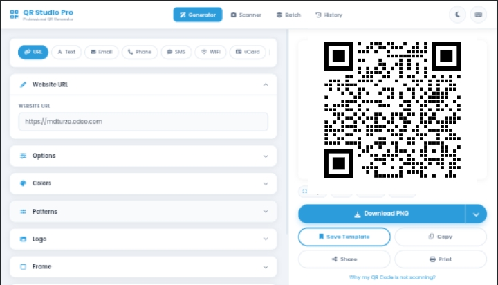

<div align="center">
 <h1> QR Craft (Pro) </h1>
</div>

<br/>

<div align="center">



<br>

**Advanced QR Code Generator — Beautiful, Fast, Fully Free & Offline**

</br>

[](LICENSE)
[](https://github.com/muhtasim-rahman/qr-craft/stargazers)
[](https://github.com/muhtasim-rahman/qr-craft/issues)


[🌐 Live Demo](https://muhtasim-rahman.github.io/qr-craft) · [🐛 Report Bug](https://github.com/muhtasim-rahman/qr-craft/issues/new) · [✨ Request Feature](https://github.com/muhtasim-rahman/qr-craft/issues/new)

</div>

---

## About

QR Studio Pro is a fully featured, client-side QR code generator built with pure HTML, CSS, and JavaScript — **no frameworks, no backend, no tracking, 100% free.** Everything runs directly in your browser and works completely offline.

---

## Features

- **16 QR types** — URL, Text, Email, Phone, SMS, WiFi, vCard, WhatsApp, Telegram, Location, Instagram, Facebook, YouTube, Twitter/X, Crypto, Calendar Event
- **Custom patterns** — 12 body patterns, 6 eye frame shapes, 6 eye inner shapes
- **Full color control** — Foreground, background, gradient (linear/radial), marker & eye colors independently
- **Logo embedding** — Upload your own or pick from 30+ brand presets (Facebook, GitHub, Bitcoin, etc.)
- **Frames** — Bottom bar, top bar, polaroid, borders with label & color options
- **12 style templates** — Classic, Galaxy, Neon, Gold, Ocean, Forest, and more
- **Save custom templates** — Stored locally in your browser
- **QR Scanner** — Camera scanning + scan from image file
- **Batch generator** — Generate up to 200 QR codes at once, download as ZIP
- **Export formats** — PNG, JPG, SVG, WebP, 2x, 4x resolution
- **Dark mode**, **Undo/Redo**, **Keyboard shortcuts**
- **History** — Last 50 generated QR codes saved automatically

---

## Getting Started

No installation needed. Just clone and open.

```bash
git clone https://github.com/muhtasim-rahman/qr-craft.git
cd qr-craft
open index.html   # or double-click it
```

Or deploy to **GitHub Pages**: Settings → Pages → Deploy from `main` branch root.

---

## Project Structure

```
qr-studio/
├── index.html          # Full UI structure
├── css/
│   └── style.css       # All styling, dark mode, responsive
└── js/
    ├── state.js        # Global state, QR types, form templates, data builders
    ├── qr-engine.js    # Canvas rendering — patterns, eyes, logo, frame, gradient
    ├── ui.js           # UI helpers, color sync, grids, toasts, modals
    ├── download.js     # PNG/JPG/SVG/WebP/2x/4x download, copy, share
    ├── templates.js    # Save/load templates + history (localStorage)
    ├── scanner.js      # Camera scanner + image file scanning
    ├── batch.js        # Batch generation + ZIP download
    └── app.js          # Boot sequence, keyboard shortcuts
```

---

## Keyboard Shortcuts

| Shortcut | Action |
|---|---|
| `Ctrl + D` | Download PNG |
| `Ctrl + S` | Save template |
| `Ctrl + Z / Y` | Undo / Redo |
| `D` | Toggle dark mode |
| `1 2 3 4` | Switch tabs |
| `?` | Show all shortcuts |
| `Esc` | Close modal |

---

## Tech Stack

Pure web platform — no build step, no npm, no frameworks.

| | |
|---|---|
| QR Generation | [qrcode.js](https://github.com/davidshimjs/qrcodejs) |
| QR Scanning | [jsQR](https://github.com/cozmo/jsQR) |
| Icons | [Font Awesome 6](https://fontawesome.com) |
| Fonts | Google Fonts — Poppins + Fira Code |

---

## Contributing

Pull requests are welcome. For major changes, please open an issue first.

1. Fork the repo
2. Create your branch: `git checkout -b feature/your-feature`
3. Commit: `git commit -m "feat: your feature"`
4. Push and open a Pull Request

---

## License

MIT License © 2025 [Muhtasim Rahman (Turzo)](https://mdturzo.odoo.com)

---

<div align="center">

*Free, open source, forever. If it helped you, drop a ⭐ star!*

[](https://github.com/muhtasim-rahman)

[](https://mdturzo.odoo.com)

</div>
